bsdmR - Bayesian SDMs with R
================

<!-- Add example code to slides! -->

## Fundamental requirements

- quality of species occurrence data
- quality of predictor variables
- extent and resolution of study area

## Species distribution models

- regression-based (e.g. GLM, GAM)
- machine learning (e.g. neural networks, boosted trees)

some methods combine the two approaches

### Decision trees

- Occam’s razor: simpler is better (avoid over-fitting)
- build small trees that accurately fit the data
- stopping criterion, pruning

but single trees have low predictive capacity!

### Decision tree ensembles

#### RF (Random Forests):

- average prediction of all trees from random subsets of the data
- ensemble of trees computed independently

#### BRT (Boosted Regression Trees), a.k.a.

- sequence of simple trees (weak learners) for previous prediction
  residuals
- sum of trees x learning rate

#### BART (Bayesian Additive Regression Trees)

- non-parametric Bayesian regression approach to an ensemble of trees
- cutting-edge alternative to other classification tree-based methods
  (RF, BRT/GBM)
- built-in complexity penalty
- inherently handles uncertainty

Chipman et al. 2010 - BART: Bayesian Additive Regression Trees  
Carlson 2020 - embarcadero: Species distribution modelling with Bayesian
Additive Regression Trees in R

## BART

BART = Bayesian regression approach to a sum of simple complementary
trees

### Basics

- it’s Bayesian: for each site, the baseline expected value (prior) is
  not a single estimate, but a probability distribution representing all
  possible estimates with associated levels of uncertainty
- the estimate is then updated to get a predicted (posterior)
  distribution based on the new evidence (species presence or absence)
- 3 prior distributions:
  - probability that a tree stops at a node of a given depth
  - probability that a given variable is chosen for a splitting rule
  - probability of splitting that variable at a particular value
- built-in complexity penalty
- defaults are sensible and generally work well
- but you can use dbarts::xbart for a cross- validation approach to
  hyperparameter selection for the tree depth prior
- advanced users can go more in depth within the BART literature to set
  better priors, though that’s usually not necessary

### Advantages

- BART provides an “out-of-the-box” procedure that is statistically
  robust, provides excellent performance, and is also robust to changes
  in parameter choices
- it’s an example of how the probabilistic framework of Bayesian
  statistics can avoid many of the problems with classical approaches

### predictive accuracy

- generally good discrimination capacity with less overfitting than
  other powerful methods
- generally good also with other aspects of model performance,
  e.g. calibration

## Two facets of model accuracy

model predictions are continuous values, not binary “presence” or
“absence”

### discrimination, classification

how well the model distinguishes presence from absence (e.g. AUC, TSS,
Kappa)

### calibration / reliability

how the continuous predicted values reflect frequency of presence
(e.g. Miller, GOF)

### Discrimination and classification

- overall accuracy / correct classification rate \[0, 1\]

- sensitivity / recall / true positive rate: correct prediction of
  presences \[0, 1\]

- specificity / true negative rate: correct prediction of absences \[0,
  1\]

- precision / positive pred. value: predicted presences that are
  observed as such \[0, 1\]

- Cohen’s kappa correct classification over chance \[-1, 1\]

- TSS (true skill statistic) balances sensitivity and specificity \[-1,
  1\]

- AUC (Area Under the ROC Curve) \[0, 1\]

  - but 0.5 means random prediction
  - equates Wilcoxon test
  - comparing predicted values for presences vs. absences
  - no single threshold required, but still measures discrimination
    (threshold implicit)

- AUC-PR (Area Under the Precision-Recall Curve)

  - more informative than ROC curve on imbalanced datasets (e.g. rare
    species)

### Calibration / reliability

- Hosmer-Lemeshow goodness-of-fit predicted probability vs. observed
  frequency within groups of data
- Miller calibration slope and intercept of a GLM of the observed values
  against the logit of predicted probabilities

### Random cross-validation

- each fold leaves out a random sample of sites
- spatial autocorrelation makes it easier to predict near analysed sites
- so, random cross-validation can underestimate prediction error and
  affect model selection

Valavi et al. (2019) <https://doi.org/10.1111/2041-210X.13107>

### Variable importance

- Number of times each variable is used by a tree split
- In models with higher numbers of trees, the difference in variable
  importance becomes less pronounced, as less informative variables
  receive a higher number of splitting rules
- Run models with few trees (default 10) and see which variables stop
  being included

this procedure is implemented automatically

``` r
varimp(mod_BART, plots = TRUE)

# get a diagnostic plot of variable importance:
varimp_BART <- varimp.diag(x.data = dat[, var_cols], y.data = dat[, spc_col])

# subjective, informal visualization purposes
```

### Variable selection

1.  Fit a model with all variables and a small ensemble of trees
    (default 10) a number of times (default 50)
2.  Remove the least informative variable across the 50
3.  Rerun model (again, 50 times) recording RMSE
4.  Repeat two previous steps until 3 variables remain
5.  Select the model with the smallest average RMSE

this procedure is implemented automatically

### Variable selection

``` r
# select minimal subset of relevant variables:
varselect <- variable.step(x.data = dat[, var_cols], y.data = dat[, spc_col])

varselect
#'  'alt' 'bio4' 'bio5' 'bio9' 'bio10' 'bio15' 'bio18'
```

### Prediction vs. uncertainty

``` r
plot(x = bart_pred$pred, y = bart_pred$uncertainty)
```

### Partial dependence plots: 1 variable

``` r
partial(mod, x.vars = "alt", ciwidth = 0.95)
partial(mod, x.vars = "bio4", smooth = 5, trace = FALSE)
```

### Partial dependence plots: 2 variables

``` r
pd2bart(mod, xind = c("alt", "bio4"))
```

### Spatial partial dependence plots

``` r
spartial(mod, envs = layers, x.vars = "alt")
spartial(mod, envs = layers, x.vars = "bio4")
```

### Map the BART learning process

``` r
# plot.mcmc(mod, var_stack, wait = 0.5, quiet = FALSE)

source("R/plot_mcmc.R")
plot_mcmc(mod, var_stack, wait = 0.5, quiet = FALSE)
```

## Practical

### Require software packages

\[BART, BayesTree, bartMachine\]

- dbarts
- embarcadero (wrapper for dbarts in a SDM context)
- blockCV
- modEvA

``` r
# Install packages
install.packages("blockCV", dep = T)
install.packages("modEvA", dep = T)
install.packages("dbarts", dep = T)
install.packages("fuzzySim", dep = T)

# embarcadero package needs to be installed from Github
# install.packages('devtools')
devtools::install_github("cjcarlson/embarcadero", dep = T)
```

### Set up the data

``` r
# DEFINE THE MODELLING COLUMNS ####

# we need a data frame with presence/(pseudo)absence of records of a species
# and a set of environmental variables:

library(bavDC)
data("aves_tk4tel")
data("odonata_tk4tel")
data("cordex_bioclim_bav_tk4tel")
data("tk4tel_grid")

library(sp)
library(raster)
library(dplyr)
library(sf)
climcur <- cordex_bioclim_bav_tk4tel %>%
    filter(time_frame == "1991-2020") %>%
    dplyr::select(-c(gcm, ensemble, rcm, rs, rcp, time_frame)) %>%
    group_by(x, y) %>%
    summarise_all(mean)
rm(cordex_bioclim_bav_tk4tel)
invisible(gc())

dat_all <- dplyr::bind_rows(aves_tk4tel, odonata_tk4tel) %>%
    dplyr::full_join(dplyr::inner_join(climcur, tk4tel_grid)) %>%
    tidyr::drop_na() %>%
    dplyr::select(-c(rown, coln, K1, K2, K3, K4, KARTE, QUAD, KARTE_QUAD, XLU, YLU,
        XRU, YRU, XRO, YRO, XLO, YLO, XQMITTE, YQMITTE))
rm(aves_tk4tel, odonata_tk4tel)
invisible(gc())

# Select only one species
dat <- filter(dat_all, species == "Saxicola_rubetra") %>%
    select(-c(species))

# Need to turn presence column into presence/absence
dat$presence <- as.numeric(dat$presence)
unique(dat$presence)
[1] 0 1

# head(dat) names(dat)
spc_col <- 1  # a species' presence/absence column IN THIS DATASET (change as appropriate!)
var_cols <- 4:22  # variables are in these columns IN THIS DATASET (change as appropriate!)
names(dat)[spc_col]  # check that it's OK
[1] "presence"
names(dat)[var_cols]  # check that it's OK
 [1] "bio1"  "bio2"  "bio3"  "bio4"  "bio5"  "bio6"  "bio7"  "bio8"  "bio9" 
[10] "bio10" "bio11" "bio12" "bio13" "bio14" "bio15" "bio16" "bio17" "bio18"
[19] "bio19"

myspecies <- names(dat)[spc_col]

# if you have spatial coordinates in the data frame, map some species and
# variables to check everything's in place:
dat_spatial <- dat
coordinates(dat_spatial) <- dat_spatial[, c("x", "y")]
crs(dat_spatial) <- "+init=epsg:31468"

spplot(dat_spatial, zcol = myspecies, cex = 0.5)
```

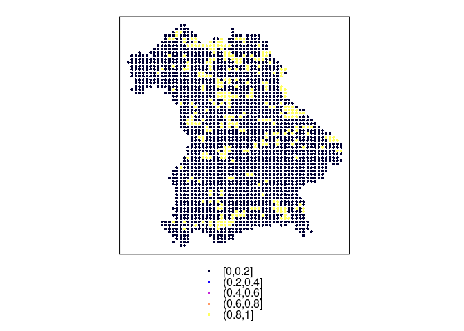<!-- -->

``` r
spplot(dat_spatial, zcol = "bio1", cex = 0.5)  # temperature
```

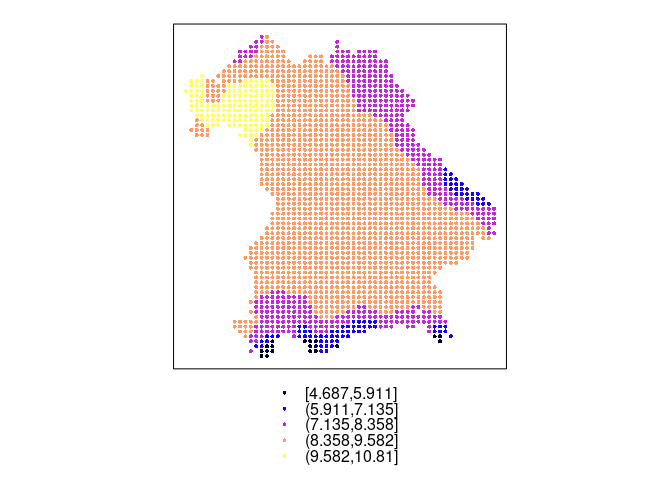<!-- -->

``` r
spplot(dat_spatial, zcol = "bio12", cex = 0.5)  # precipitation
```

<!-- -->

``` r
# for the meanings of the 'bio' variables, see
# https://www.worldclim.org/data/bioclim.html

# Create TSA layer for considering migration/dispersal
library(fuzzySim)
dat_spatial$spatial_trend <- multTSA(data = dat, sp.cols = spc_col, coord.cols = c("x",
    "y"))[, 1]
spplot(dat_spatial, "spatial_trend")
```

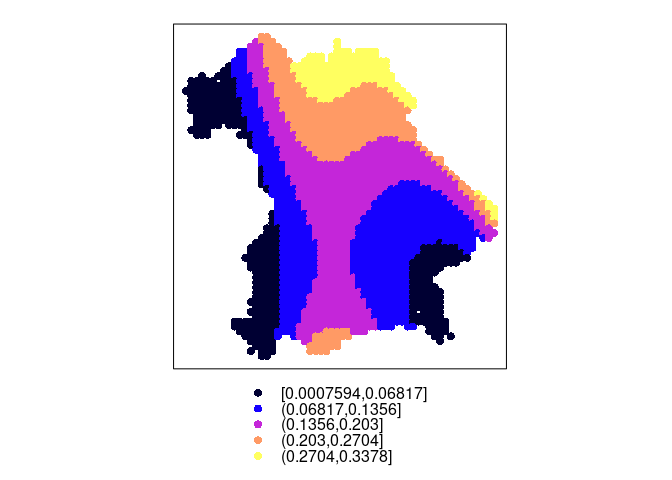<!-- -->

### Compute BART model

``` r
# COMPUTE BAYESIAN ADDITIVE REGRESSION TREES (BART) ####

library(embarcadero)
set.seed(123)  # set a seed of random numbers so next command yields the same result in different runs of the script
mod_BART <- bart(y.train = dat[, myspecies], x.train = dat[, var_cols], keeptrees = TRUE,
    verbose = F)
# nchain = 4, nthread = 4, keeptrainfits = FALSE, ndpost = 3e3

# if you want to use this BART model e.g. for prediction or for plotting
# response curves IN FUTURE R SESSIONS, you need to run the following command
# to explicitly ask for the full information to be included when you save the
# model object:
invisible(mod_BART$fit$state)
```

### Model Summary

    Call:  bart dat[, var_cols] dat[, myspecies] F TRUE 
     
    Predictor list: 
     bio1 bio2 bio3 bio4 bio5 bio6 bio7 bio8 bio9 bio10 bio11 bio12 bio13 bio14 bio15 bio16 bio17 bio18 bio19 
     
    Area under the receiver-operator curve 
    AUC = 0.8215912 
     
    Recommended threshold (maximizes true skill statistic) 
    Cutoff =  0.1845457 
    TSS =  0.4981353 
    Resulting type I error rate:  0.2643312 
    Resulting type II error rate:  0.2375335 

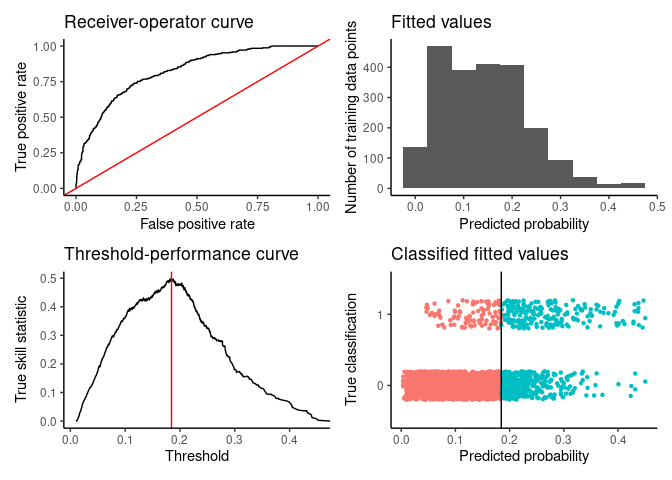<!-- -->

### Get predictions

``` r
# GET PREDICTIONS ON THE DATA TABLE ####

source("https://raw.githubusercontent.com/AMBarbosa/unpackaged/master/predict_bart_df")
# I edited the 'embarcadero' predict function to work on data frames rather
# than raster layers

dat$BART_P <- predict_bart_df(mod_BART, dat)  # can take time for large datasets!
# head(dat) # predictions now on the table

# predict on a data frame with CI intervals
bart_pred <- predict_bart_df(mod_BART, dat, quantiles = c(0.025, 0.975))
# result is a data frame with 3 columns:

# map the predictions:
dat_spatial$BART_P <- dat$BART_P
spplot(dat_spatial, zcol = "BART_P", cex = 0.5)
```

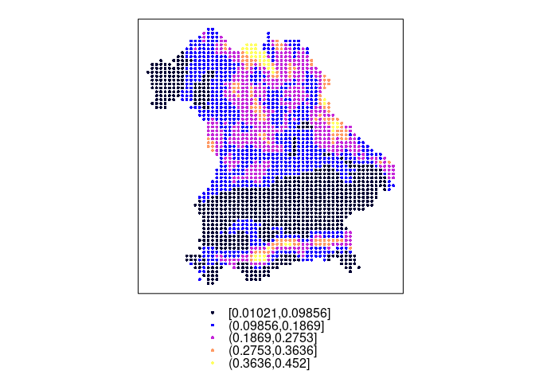<!-- -->

``` r
# GET PREDICTIONS ON A RASTER STACK #### (if you have also raster maps of your
# variables)

data("tk4tel_grid", package = "bavDC")
tk4tel_grid <- tk4tel_grid %>%
    raster::rasterFromXYZ()
raster::projection(tk4tel_grid) <- sp::CRS("+init=epsg:31468")

clim_spatial <- dat_all %>%
    select(-c(presence, species))
coordinates(clim_spatial) <- clim_spatial[, c("x", "y")]
crs(clim_spatial) <- "+init=epsg:31468"
climdat <- raster::rasterize(clim_spatial, tk4tel_grid)

var_stack <- raster::crop(climdat, tk4tel_grid)
rm(climdat, tk4tel_grid, climcur)
invisible(gc())
raster::projection(var_stack) <- "+init=epsg:31468"
var_stack <- var_stack[[4:nlayers(var_stack)]]

# var_stack
plot(var_stack)
```

<!-- -->

``` r
BART_P <- predict2.bart(mod_BART, x.layers = var_stack)  # can take time for large or high-resolution rasters!
plot(BART_P)
```

<!-- -->

``` r
# save the created objects to disk for future use:
save(mod_BART, file = "data/mod_BART.rda", compress = "xz")
writeRaster(BART_P, "data/BART_pred.tif", overwrite = T)  # you can open this in GIS software
save(bart_pred, file = "data/bart_pred.rda", compress = "xz")
rm(bart_pred)
invisible(gc())
```

### Evaluate model predictions

``` r
library(modEvA)

# area under the ROC Curve:
par(mfrow = c(1, 1), mar = c(5, 4, 2, 1))
AUC(obs = dat[, myspecies], pred = dat[, "BART_P"])  # see the 'plots' pane
```

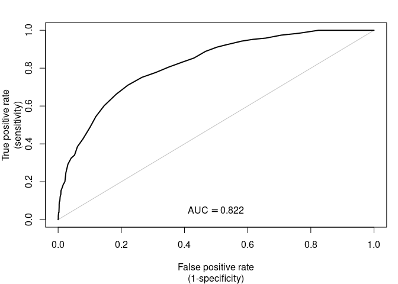<!-- -->

``` r

# area under the precision-recall Curve:
AUC(obs = dat[, myspecies], pred = dat[, "BART_P"], curve = "PR")
```

<!-- -->

``` r

# threshold-based classification metrics:

# first, let's convert our predictions of presence probability into binary
# presence or absence you don't normally need to do this, but be aware that
# when using threshold-based measures, the binarized prediction is what you are
# actually evaluating first, calculate the binarization threshold that
# optimizes TSS:
opt <- optiThresh(obs = dat[, myspecies], pred = dat[, "BART_P"], measures = "TSS",
    optimize = "each", interval = 1e-04)
```

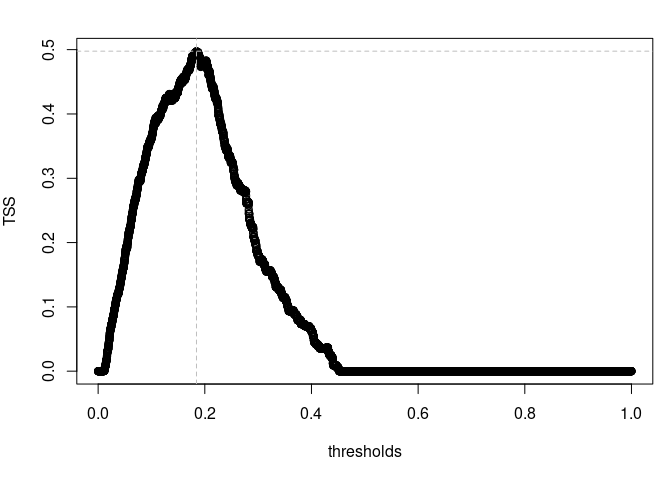<!-- -->

``` r
TSSthresh <- opt$optimals.each$threshold
# then apply this threshold to reclassify the model predictions intos zeros and
# ones:
dat$BART_P_01 <- ifelse(dat$BART_P >= TSSthresh, 1, 0)
# head(dat)
dat_spatial$BART_P_01 <- dat$BART_P_01
spplot(dat_spatial, zcol = "BART_P_01")
```

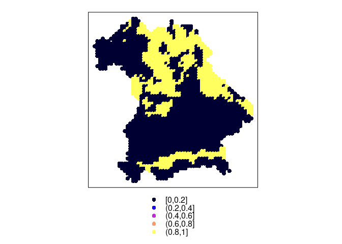<!-- -->

``` r

# binarize also the raster predictions:
BART_P_01 <- BART_P
BART_P_01[] <- ifelse(BART_P[] >= TSSthresh, 1, 0)
par(mfrow = c(1, 2))
plot(BART_P)
plot(BART_P_01)
```

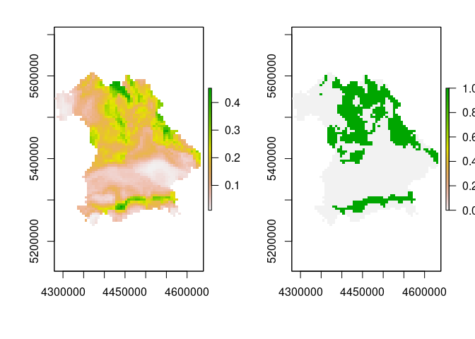<!-- -->

``` r
rm(BART_P, BART_P_01)
invisible(gc())

classif_metrics <- c("CCR", "Sensitivity", "Specificity", "Precision", "Recall",
    "TSS", "kappa")
par(mfrow = c(1, 1))
threshMeasures(obs = dat[, myspecies], pred = dat[, "BART_P"], thresh = "preval",
    measures = classif_metrics, ylim = c(0, 1))
```

<!-- -->

``` r

# now let's look at some measures of calibration, which assess the accuracy of
# the continuous predictions:

# Miller calibration line:
MillerCalib(obs = dat[, myspecies], pred = dat[, "BART_P"])
```

<!-- -->

``` r

# Hosmer-Lemeshow goodness-of-fit:
HLfit(obs = dat[, myspecies], pred = dat[, "BART_P"], bin.method = "round.prob")
```

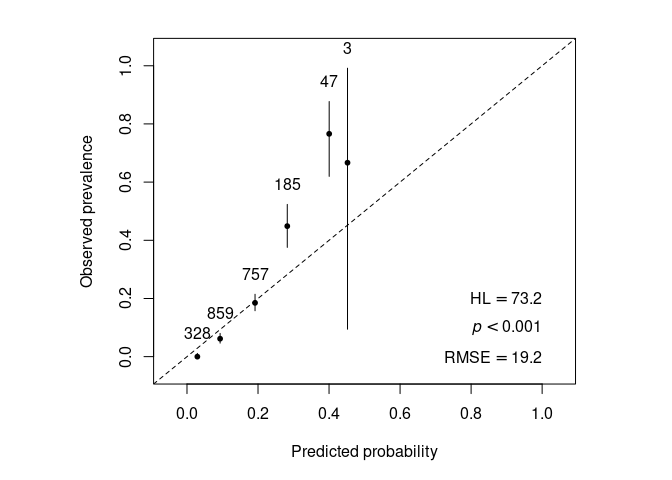<!-- -->

``` r
HLfit(obs = dat[, myspecies], pred = dat[, "BART_P"], bin.method = "n.bins", n.bins = 20)
```

<!-- -->

``` r
# beware: results may strongly depend on the arbitrary choice of binning
# method!

# BUT THIS JUST EVALUATES HOW THE MODELS FIT THE SAME DATA ON WHICH THEY WERE
# TRAINED YOU CAN SET ASIDE SOME DATA TO LEAVE OUT OF MODEL TRAINING AND USE
# FOR TESTING OUT-OF-SAMPLE PREDICTIVE CAPACITY BLOCK CROSS-VALIDATION (below)
# IS CURRENTLY THE MOST APPROPRIATE METHOD
```

### Block cross-validation

<!-- spatialBlock does not work, because sp and raster object supposedly do not have the same crs -->

``` r
library(blockCV)
library(automap)

# DIVIDE STUDY AREA INTO SPATIAL BLOCKS #### for model cross-validation

# names(dat)

# if you have your variables as maps in a raster stack, you can calculate their
# range of spatial autocorrelation but note that this can be too stringent,
# i.e. make blocks too large for the model training sets to contain sufficient
# information
sarange <- spatialAutoRange(var_stack, progress = F)  # see the 'plots' pane
sarange$range  # you could use this as 'theRange' argument in for 'spatialBlock' below, but if this range is too large, the model may be too limited to perform well!

# get spatial blocks of a given size (e.g. 25 km2):
set.seed(321)  # set a seed of random numbers so next command yields the same result in different runs of the script
# dat_spatial <- sf::st_transform(sf::st_as_sf(dat_spatial),
# crs=raster::crs(var_stack))

rast <- raster::raster(nrow = 67, ncol = 58, resolution = c(6100, 5550), ext = extent(var_stack),
    crs = raster::projection(var_stack))
# crs(rast) <- '+init=epsg:31468'

# dat_spatial2 <- sf::st_as_sf(dat, coords=c('x', 'y'), crs =
# raster::crs(rast)) dat_spatial2 <- rast <- projectRaster(rast,
# crs=crs(dat_spatial2))

# sf::st_crs(dat_spatial) <-'+init=epsg:31468'

blocks <- spatialBlock(speciesData = dat_spatial, species = myspecies, rasterLayer = rast,
    theRange = 25000, k = 5)
# argument 'species' is optional and makes the process slower - see
# ?spatialBlock

blocks$folds
blocks$foldID

dat$foldID <- blocks$foldID
head(dat)

# map each fold:
dat_spatial$foldID <- dat$foldID
folds <- sort(unique(dat$foldID))
par(mfrow = c(3, 2), mar = c(1, 1, 1, 1))
for (f in folds) {
    plot(dat_spatial, col = "grey")
    points(subset(dat_spatial, foldID == f), col = "blue")
    title(paste("Fold", f))
}

# COMPUTE MODELS AND GET PREDICTIONS LEAVING OUT EACH FOLD IN TURN ####

names(dat)

for (f in folds) {
    print(f)
    dat_train <- subset(dat, foldID != f)
    mod_BART_fold <- bart(x.train = dat_train[, var_cols], y.train = dat_train[,
        myspecies], keeptrees = TRUE, verbose = FALSE)
    dat[, paste0("BART_fold", f, "_P")] <- predict_bart_df(mod_BART_fold, dat)
}  # end for f

# see the new predictions added to the the data frame:
head(dat)

# EVALUATE EACH MODEL ON ITS VALIDATION FOLD ####

# identify columns containing the predictions of different folds:
fold_cols <- grep("_fold", names(dat))
fold_cols
names(dat)[fold_cols]

# choose some measures to calculate:
measures <- c("AUC", "AUPR", "TSS", "MCS")

# create an empty table to receive the cross-validation results:
crossval <- as.data.frame(matrix(nrow = length(folds), ncol = length(measures)))
colnames(crossval) <- measures
crossval  # for now it's only filled with NAs

par(mfrow = c(2, 2), mar = c(4, 3, 1, 1), oma = c(0, 0, 2, 0))
for (f in folds) {
    fold_col <- names(dat)[grep(paste0("BART_fold", f), names(dat))]
    fold_dat <- subset(dat, foldID == f)
    crossval[f, "AUC"] <- AUC(obs = fold_dat[, myspecies], pred = fold_dat[, fold_col],
        simplif = TRUE, plot = TRUE, main = "AUC")
    crossval[f, "AUPR"] <- AUC(obs = fold_dat[, myspecies], pred = fold_dat[, fold_col],
        curve = "PR", simplif = TRUE, plot = TRUE, main = "AUPR")
    crossval[f, "TSS"] <- threshMeasures(obs = fold_dat[, myspecies], pred = fold_dat[,
        fold_col], thresh = "preval", measures = "TSS", simplif = TRUE, standardize = FALSE,
        main = "TSS")
    crossval[f, "MCS"] <- MillerCalib(obs = fold_dat[, myspecies], pred = fold_dat[,
        fold_col], main = "Miller line")$slope
    HLfit(obs = fold_dat[, myspecies], pred = fold_dat[, fold_col], bin.method = "round.prob",
        verbosity = 1, main = "H-L fit")
    mtext(paste("Fold", f), outer = TRUE, cex = 1.5)
}
# press the back arrow on the top left of your plotting pane to see the
# different fold evaluations

# see the previously created table now filled with the cross-validation
# results:
crossval

# boxplots of cross-validation metrics:
par(mfrow = c(1, 1), mar = c(7, 3, 2, 1))
boxplot(crossval, las = 2)
abline(h = 1, col = "darkgrey", lty = 2)
# remember Miller calibration slope (MCS) should ideally be close to 1 (not
# bigger = better)
```

### Variable importance

``` r
# VARIABLE IMPORTANCE AND VARIABLE SELECTION ####

# get the importance of each variable in our previously built model:
varimp(mod_BART, plots = TRUE)
```

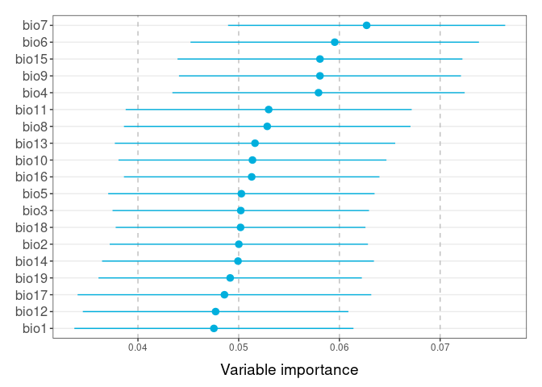<!-- -->

``` r

# get a diagnostic plot of variable importance for our data and variables: (you
# can skip this step if it takes way too long, as results are just visual and
# not needed further in the script)

varimp_BART <- varimp.diag(x.data = dat[, var_cols], y.data = dat[, myspecies], iter = 10,
    quiet = T)  # the recommended default is 50 iterations; I dropped it to 10 to save some time here, but WHEN YOU DO THIS FOR REAL ANALYSIS, REMOVE 'iter = 10' !!!!!
```

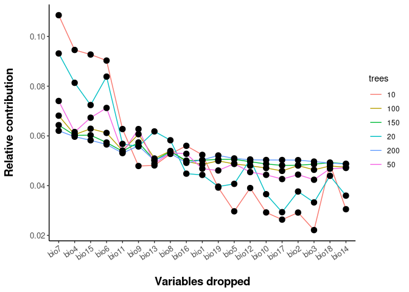<!-- -->

``` r

# varimp_BART
rm(varimp_BART)
invisible(gc())
```

### Variable selection

``` r
# select minimal subset of relevant variables:
set.seed(456)
varselect <- variable.step(x.data = dat[, var_cols], y.data = dat[, myspecies], iter = 10,
    quiet = T)  # again, I reduced the number of iterations to 10 to save time here, but the sensible default is 50, so REMOVE 'iter = 10' WHEN YOU DO MORE SERIOUS WORK !!!!!
```

<!-- -->

``` r

varselect
# for the meanings of these variables, see
# https://www.worldclim.org/data/bioclim.html
```

### Model building

``` r
# build a final model with the selected variables:

set.seed(4)
mod_BART_varselect <- bart(x.train = dat[, varselect], y.train = dat[, myspecies],
    keeptrees = TRUE, verbose = F)

# summary(mod_BART_varselect)

# you could also do these steps (varimp.diag, variable.step, bart, varimp and
# summary) in one go, with the 'bart.step' function [THIS CAN TAKE A LONG TIME
# AND THE RESULT IS THE SAME AS OUR 'mod_BART_varselect']:

# mod_BART_step <- bart.step(x.data = dat[ , var_cols], y.data = dat[ ,
# myspecies], iter.step = 10, iter.plot = 10) # remember I reduced the number
# of iterations to save time here, but REMOVE 'iter.step = 10, iter.plot = 10'
# WHEN YOU DO MORE SERIOUS WORK !!!!!
```

### Parameter fine-tuning

``` r
# BART models are good at providing adequate priors with the default settings,
# but you can achieve even higher predictive performance if you fine-tune the 3
# prior parameters via cross-validation:

mod_BART_tuned <- retune(mod_BART_varselect)  # this may take a very long time!
```

- wrapper for dbarts::xbart – a cross-validation approach to the
  selection of parameters for the priors
- computer-intensive and usually not necessary (as default parameters
  perform well), but can slightly improve predictive capacity

### Model summary II

``` r
summary(mod_BART_tuned)
```

### Prediction with credible intervals

``` r
# predict on a data frame:
bart_pred_varselect <- predict_bart_df(mod_BART_varselect, dat, quantiles = c(0.025,
    0.975))
# result is a data frame with 3 columns:

# add uncertainty (credible interval width):
bart_pred_varselect$uncertainty <- bart_pred_varselect[, 3] - bart_pred_varselect[,
    2]

# predict on a raster stack:
BART_P <- predict(mod_BART_varselect, var_stack, quantiles = c(0.025, 0.975))

# result is a RasterStack with 3 layers:
par(mfrow = c(2, 2), mar = c(3, 2, 2, 2))  # set 2x2 plots per window
plot(BART_P[[1]], main = "Posterior mean")
plot(BART_P[[2]], main = "Lower 95% CI bound")
plot(BART_P[[3]], main = "Upper 95% CI bound")
uncertainty <- BART_P[[3]] - BART_P[[2]]
plot(uncertainty, main = "Credible interval width")
```

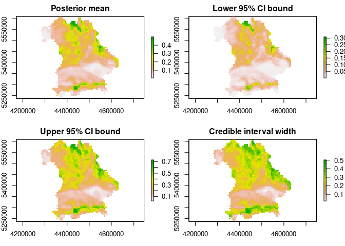<!-- -->

``` r
rm(BART_P)
invisible(gc())

par(mfrow = c(1, 1), mar = c(4, 4, 2, 1))
plot(sort(bart_pred_varselect$pred), pch = ".")
lines(sort(bart_pred_varselect$q0025), col = "grey")
lines(sort(bart_pred_varselect$q0975), col = "grey")
```

<!-- -->

### Prediction vs. uncertainty

``` r
par(mfrow = c(1, 1), mar = c(4, 4, 2, 1))
plot(x = bart_pred_varselect$pred, y = bart_pred_varselect$uncertainty)
```

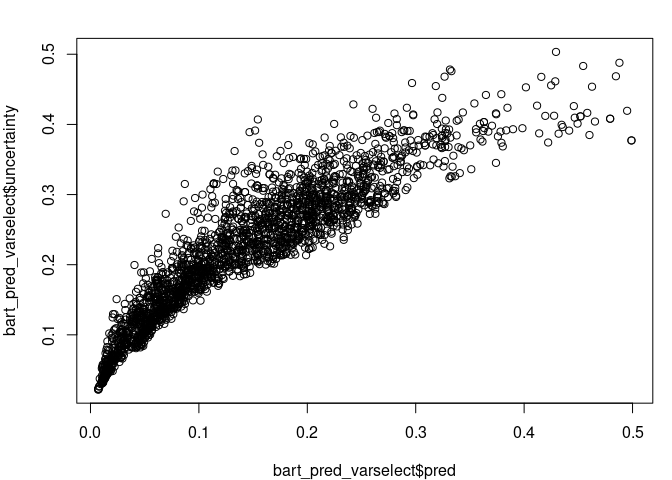<!-- -->

### Partial dependence plots: 1 variable

``` r
# PARTIAL DEPENDENCE PLOTS ####

# get partial dependence plots (with Bayesian confidence intervals) for
# different variables, e.g. the first 2 in 'varselect': varselect

partial_BART_1 <- embarcadero::partial(mod_BART_varselect, x.vars = varselect[1],
    trace = FALSE)  # takes time!

partial_BART_2 <- embarcadero::partial(mod_BART_varselect, x.vars = varselect[2],
    smooth = 5, trace = FALSE)

library(ggplot2)
library(patchwork)
partial_BART_1[[1]] + partial_BART_2[[1]]
```

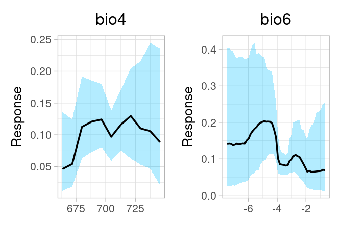<!-- -->

``` r

# you can get the partial dependence plots for all variables in the model at
# once, but notice this may take a very long time! par(mfrow = c(4, 2))
# partials <- partial(mod_BART_varselect) partials

rm(partial_BART_1, partial_BART_2)
invisible(gc())
```

### Partial dependence plots: 2 variables

``` r
# get a two-dimensional dependence plot, e.g. using the first 2 selected
# variables:
partial_BART_1and2 <- pd2bart(mod_BART_varselect, xind = c(varselect[1], varselect[2]))
par(mfrow = c(1, 1), mar = c(5, 5, 2, 1))
plot(partial_BART_1and2)
```

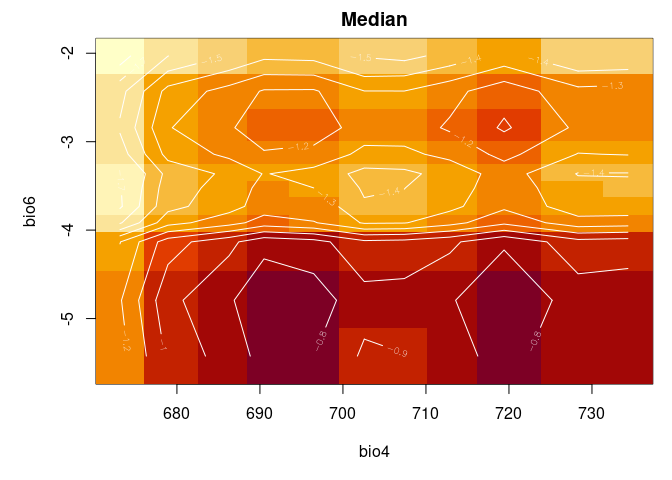<!-- -->

``` r

# you can also choose variables by name (if they are in this model!):
# partial_BART_bio4_bio5 <- pd2bart(mod_BART_varselect, xind = c('bio4',
# 'bio5'))
```

### Spatial partial dependence plots

``` r
# SPATIAL PARTIAL DEPENDENCE PLOTS ####

# these are a cartographic version of partial dependence plots, showing where a
# particular variable most favours species presence

spartial_BART_1 <- spartial(mod_BART_varselect, envs = var_stack, x.vars = varselect[1])
spartial_BART_2 <- spartial(mod_BART_varselect, envs = var_stack, x.vars = varselect[2])

par(mfrow = c(1, 2))
plot(spartial_BART_1, main = paste("partial prediction:", varselect[1]))
plot(spartial_BART_2, main = paste("partial prediction:", varselect[2]))
```

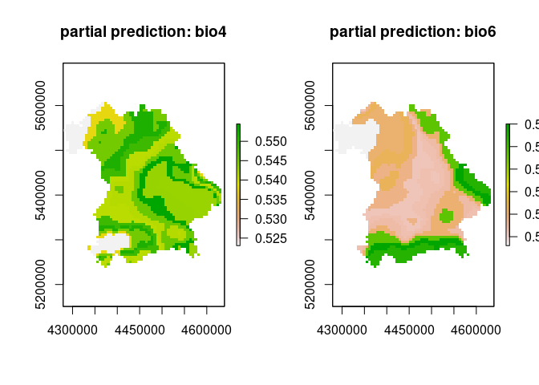<!-- -->

``` r

# you can generate plots with different variables and combinations, to see how
# each variable or interaction affects your species try interpreting the
# results in light of your species' ecology read each function's help file and
# possibly try alternative options
```

### Map the BART learning process

``` r
# plot the MCMC draws (BART learning process):
source("R/plot_mcmc.R")
par(mfrow = c(1, 1))
plot_mcmc(mod_BART_varselect, var_stack, wait = 0.5, quiet = TRUE)

 Generating the posterior predictions (takes a second) 

 Generating plots 
```

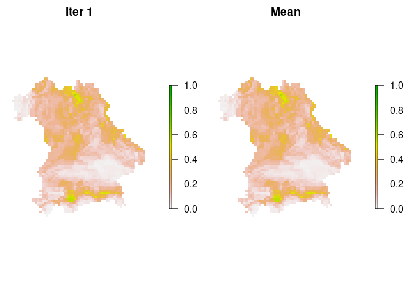<!-- -->

### Store results for future use

``` r
# save results for future use:

# if you want to use this BART model e.g. for prediction or for plotting
# response curves IN FUTURE R SESSIONS, you first need to explicitly ask for
# the full information to be included when you next save the model object:
invisible(mod_BART_varselect$fit$state)
save(mod_BART_varselect, file = "data/mod_BART_varselect.rda", compress = "xz")
save(bart_pred_varselect, file = "data/bart_pred_varselect.rda", compress = "xz")
```
